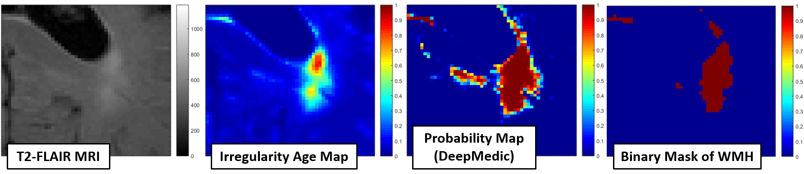
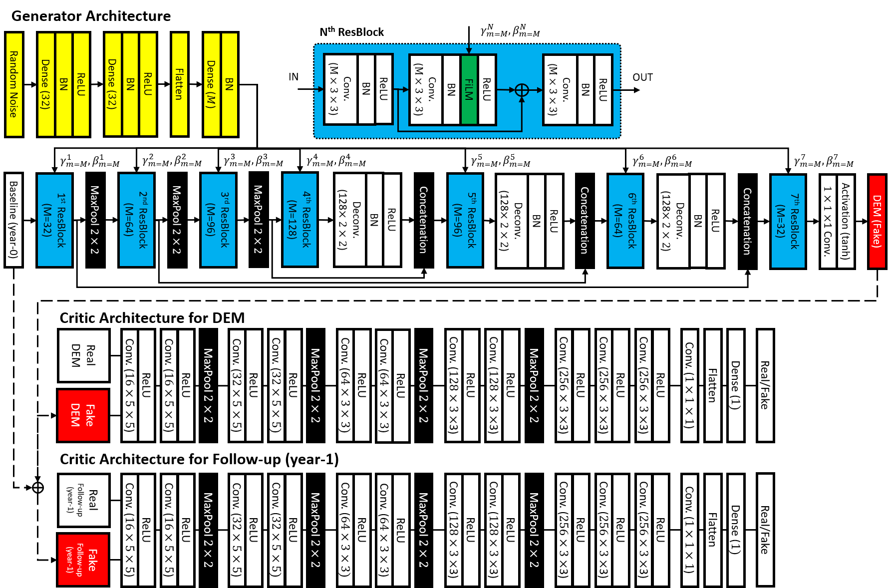
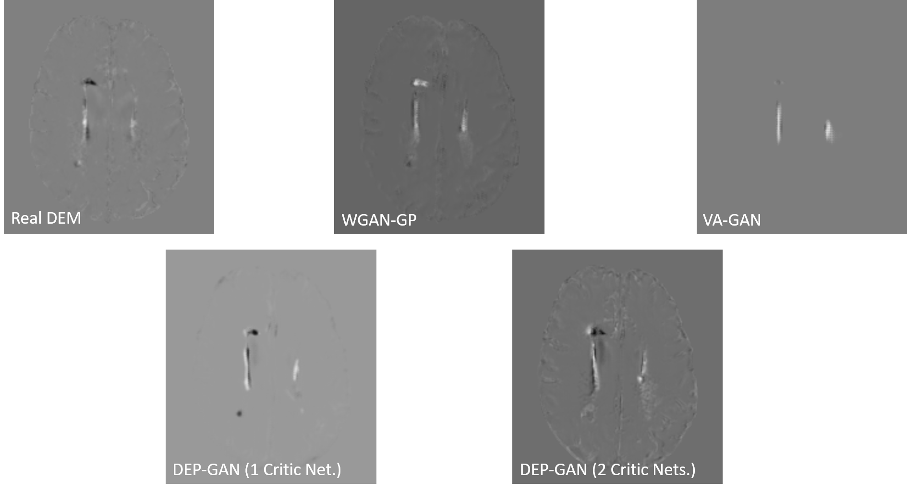

# Disease Evolution Predictor GAN (DEP-GAN) and U-ResNet (DEP-UResNet)
This is codes for both DEP-GAN (non-supervised model) and DEP-UResNet (supervised model) to predict the evolution (i.e., progression and regression) of white matter hyperintensities (WMH). All codes will be updated regularly. It is expected to publish the final version of the code before March 2020.

Quick explanation of DEP-GAN can be found in ["About DEP-GAN" section](https://github.com/febrianrachmadi/dep-gan-im#about-dep-gan-excerpt-from-our-miccai-2019-paper). Whereas, full explanation of DEP-GAN can be read and found in:
 - manuscript titled **Automatic Spatial Estimation of White Matter Hyperintensities Evolution in Brain MRI using Disease Evolution Predictor Deep Neural Networks** [[pre-print]](https://doi.org/10.1101/738641), or
 - our MICCAI 2019 paper titled **Predicting the Evolution of White Matter Hyperintensities in Brain MRI using Generative Adversarial Networks and Irregularity Map** [[full-paper]](https://doi.org/10.1007/978-3-030-32248-9_17) [[pre-print]](https://doi.org/10.1101/662692).
 
We would recommend the second manuscript as it contains full information about both DEP-GAN and DEP-UResNet.

This code/publication is part of [our research projects](https://febrianrachmadi.github.io/projects/):
 - Disease Evolution Predictor Deep Neural Networks
 - Characterisation of WMH in Brain MRI using Irregularity Map

## News/Update
 - 09/01/2020: Added the final code for testing DEP-GAN and DEP-UResNet.
 - 08/01/2020: Added the final code of DEP-UResNet and its example of trained weights.
 - 07/01/2020: Added the final code of DEP-GAN and its example of trained weights.
 - 13/06/2019: Example of setting files are now online!
 - 12/06/2019: Provisional codes of DEP-GAN are now online!
 
## Version
 - v0.2.0: Testing codes are now available.
 - v0.1.0: Training codes and trained weighst are now available.
 - v0.0.2: Setting files for training are now available.
 - v0.0.1: This is the provisional codes of DEP-GAN using irregularity map (IM).

## About the Code

There are two training codes available, which are:
 - [Disease Evolution Predictor GAN (DEP-GAN)](https://github.com/febrianrachmadi/dep-gan-im/blob/master/DEP-GAN_PROB_IM_twoCritics_training_4fold.py), which is a non-supervised method for predicting the evolution (i.e., progression and regression) of WMH.
 - [Disease Evolution Predictor U-ResNet (DEP-UResNet)](https://github.com/febrianrachmadi/dep-gan-im/blob/master/DEP-UResNet-wNoises-training-4fold.py), which is a supervised method for predicting the evolution (i.e., progression and regression) of WMH.
 
One can find both network architectures inside the codes. The trained weights of both networks can be found in [models directory](https://github.com/febrianrachmadi/dep-gan-im/tree/master/models). Three different sets of trained weighst can be found:
 - DEP-GAN using irregularity map (IM) [_unsupervised model_]: netG_depgan_twoCritics_im_noSL_30052019_fold*.h5
 - DEP-GAN using probability map (PM) [_indirectly supervised model_]: netG_depgan_twoCritics_prob_noSL_21102019_fold*.h5
 - DEP-UResNet [_supervised model_]: trained_depuresnet_pNoises_T02_19042019_fold*.h5

## Citation
If you find this code is useful, please cite the publication below.
 - Rachmadi, M. F., Valdés-Hernández, M. D. C., Makin, S., Wardlaw, J. M., & Komura, T. (2019). **Automatic Spatial Estimation of White Matter Hyperintensities Evolution in Brain MRI using Disease Evolution Predictor Deep Neural Networks**. bioRxiv, 738641. [[pre-print]](https://doi.org/10.1101/738641)
 - Rachmadi, M. F., Valdés-Hernández, M. D. C., Makin, S., Wardlaw, J. M., & Komura, T. (2019). **Predicting the Evolution of White Matter Hyperintensities in Brain MRI using Generative Adversarial Networks and Irregularity Map**. In: Shen D. et al. (eds) _Medical Image Computing and Computer Assisted Intervention – MICCAI 2019_. MICCAI 2019. Lecture Notes in Computer Science, vol 11766. Springer, Cham. [[full-paper]](https://doi.org/10.1007/978-3-030-32248-9_17) [[pre-print]](https://doi.org/10.1101/662692)

## Authors
 - [Febrian Rachmadi](https://febrianrachmadi.github.io/) - Main author of the DEP-GAN (idea and codes)
 - [Prof. Taku Komura](http://homepages.inf.ed.ac.uk/tkomura/) - Supervisor in machine learning, artificial intelligent, and computer vision field (School of Informatics, University of Edinburgh)
 - [Dr. Maria Valdés Hernández](https://www.research.ed.ac.uk/portal/en/persons/maria-valdes-hernandez(f22f22d9-52bb-4883-bf94-52aa23a691e1).html), Dr. Stephen Makin, [Prof. Joanna M. Wardlaw](https://www.research.ed.ac.uk/portal/en/persons/joanna-wardlaw(8f7981c3-eb73-45f1-a191-d547f08e74f0).html) - Supervisors in neuroimaging, medical and clinical fields (Medical School, University of Edinburgh)
 
## About DEP-GAN (Excerpt from [our MICCAI 2019 paper](https://doi.org/10.1007/978-3-030-32248-9_17))

White Matter Hyperintensities (WMH) are neuroradiological features in T2-weighted and fluid attenuated inversion recovery  (T2-FLAIR) brain Magnetic Resonance Images (MRI) that have been associated with stroke and dementia progression [13]. A  previous study has shown that the volume of WMH on a patient may decrease (regress), stay the same, or increase (progress) over a period of time [2]. In this study, we refer to these changes as "evolution of WMH".

In this study, we propose an end-to-end training model for predicting the evolution of WMH from base line to the following year using generative adversarial network (GAN) [4] and irregularity map (IM) [8,7]. This study differs from other previous studies on predictive modelling focused on the progression of disease and/or its effect (e.g., progression of cognitive decline in Alzheimer’s disease patient [3]). Instead, we are interested in predicting the evolution of specific neuroradiological features in MRI (i.e., WMH in T2-FLAIR). Using our proposed model, clinicians can estimate the size and location of WMH in time to study their progression/regression in relation to clinical health and disease indicators, for ultimately design more effective therapeutic intervention.

Irregularity map (IM) in our context is a map/image that describes the "irregularity" level for each voxel with respect to the normal brain white matter tissueusing real values between 0 and 1 [8]. The IM is advantageous as it retains some of the original MRI textures (e.g., of the T2-FLAIR image intensities), including gradients of WMH (see Fig. 1).

Figure 1: Comparison between irregularity map, probability map (produced by DeepMedic), and binary mask.

Evolution of WMH at two time points can be obtained by subtracting the baseline IM from the follow-up IM. We call the resulted image “Disease Evolution Map” (DEM) where its values range from -1 to 1. DEM’s values represent the magnitude of the longitudinal change, where negative values mean regression and positive values mean progression. As seen in Fig. 2, DEM calculated from IM represents WMH evolution better than the one calculated from normalised T2-FLAIR MRI. Note how both regression and progression (i.e. dark blue and bright yellow pixels in the figure) are well represented on the DEM from IM at voxel level precision. T2-FLAIR MRI is not ideal to generate DEM as their voxel values are rather a qualitative representation of the tissue’s spin-spin relaxation time as it decays towards its equilibrium value. Whereas, IM is a quantitative result of assessing how different each voxel is with respect to the ones that make most of the brain tissue voxels (i.e. in T2-FLAIR MRI in this case) [7].

")
Figure 2: Normalised T2-FLAIR (top) and corresponding irregularity maps (IM) (bottom) produced by using LOTS-IM [7]. “Disease Evolution Map” (DEM) (right) is produced by subtracting baseline images (middle) from follow-up images (left). In DEM, bright yellow pixels represent positive values (i.e., pro-gression) while dark blue pixels represent negative values (i.e., regression).

We propose a GAN model for predicting WMH evolution namely disease evolution predictor GAN (DEP-GAN). DEP-GAN consists of a generator loosely based on U-Net [9] and two convolutional network critics, where baseline images are feed-forwarded to the  generator and fake/real images of follow-up and DEM are feedforwarded to two different critics (see Fig. 3 and Fig. 4). Results example of the resulted DEM can be seen in Fig. 5. Please, refer to [our MICCAI 2019 paper](https://doi.org/10.1101/662692) for full explanation of DEP-GAN model.

")
Figure 3: Schematic of the proposed DEP-GAN with 2 discriminators (critics).

Figure 4: Architecture of generator (top) and critics (bottom) of DEP-GAN. Note the proposed additional randomness scheme is also depicted where random noises are encoded using convolutional layers (yellow) and then modulated to the generator using FiLM layer (green) inside ResBlock (light blue).

Figure 5: Comparison between real DEM and fake DEM generated from different networks of GANs.

Please read both of our papers [MICCAI 2019](https://doi.org/10.1007/978-3-030-32248-9_17) and [manuscript](https://doi.org/10.1101/738641) for full explanation of our proposed methods.

## Acknowledgement
Funds from the Indonesia Endowment Fund for Education (LPDP), Ministry of Finance, Republic of Indonesia (Febrian Rachmadi); Row Fogo Charitable Trust (Grant No. BRO-D.FID3668413) (Maria Valdés-Hernández); Wellcome Trust (patient recruitment, scanning, primary study Ref No. WT088134/Z/09/A); Fondation Leducq (Perivascular Spaces Transatlantic Network of Excellence); EU Horizon 2020 (SVDs@Target); and the MRC UK Dementia Research Institute at the University of Edinburgh (Wardlaw programme) are gratefully acknowledged.

## License

This project is licensed under the BSD 3-Clause License - see the [LICENSE](LICENSE) file for details.

## References
 1. Baumgartner, C.F., et al.: Visual feature attribution using wasserstein gans. In: 2018 IEEE/CVF Conference on Computer  Vision and Pattern Recognition. pp.8309–8319 (June 2018)
 2. Chappell, F.M., et al.: Sample size considerations for trials using cerebral white matter hyperintensity progression as an intermediate outcome at 1 year after mild stroke: results of a prospective cohort study. Trials 18(1), 78 (Feb 2017)
 3. Choi, H., et al.: Predicting cognitive decline with deep learning of brain metabolism and amyloid imaging. Behavioural Brain Research344, 103 – 109 (2018)
 4. Gulrajani, I., et al.: Improved training of wasserstein gans. In: Proceedings of the 31st International Conference on Neural Information Processing Systems. pp.5769–5779. NIPS’17, Curran Associates Inc., USA (2017)
 5. Jenkinson, M., et al.: Improved optimization for the robust and accurate linear registration and motion correction of brain images. NeuroImage17(2), 825 – 841(2002)
 6. Perez, E., et al.: Film: Visual reasoning with a general conditioning layer. In: Thirty-Second AAAI Conference on Artificial Intelligence (2018)
 7. Rachmadi, M.F., et al.: Limited one-time sampling irregularity map (lots-im) for automatic unsupervised assessment of white matter hyperintensities and multiple sclerosis lesions in structural brain magnetic resonance images. bioRxiv (2019)
 8. Rachmadi, M.F., et al.: Automatic irregular texture detection in brain mri without human supervision. In: International Conference on Medical Image Computing and Computer Assisted Intervention – MICCAI 2018. pp. 506–513. Springer (2018)
 9. Ronneberger, O., et al.: U-net: Convolutional networks for biomedical imagesegmentation. In: International Conference on  Medical image computing and computer-assisted intervention – MICCAI 2015. pp. 234–241. Springer (2015)
 10. Schmidt, R., et al.: Longitudinal change of small-vessel disease-related brain abnormalities. Journal of Cerebral Blood Flow & Metabolism 36(1), 26–39 (2016)
 11. Valdés Hernández, M.d.C., et al.: Rationale, design and methodology of the image analysis protocol for studies of patients with cerebral small vessel disease and mild stroke. Brain and behavior 5(12), e00415 (2015)
 12. Wardlaw, J.M., et al.: White matter hyperintensity reduction and outcomes after minor stroke. Neurology 89(10), 1003–1010 (2017)
 13. Wardlaw, J.M., et al.: Neuroimaging standards for research into small vessel diseaseand its contribution to ageing and neurodegeneration. The Lancet Neurology12(8),822 – 838 (2013
